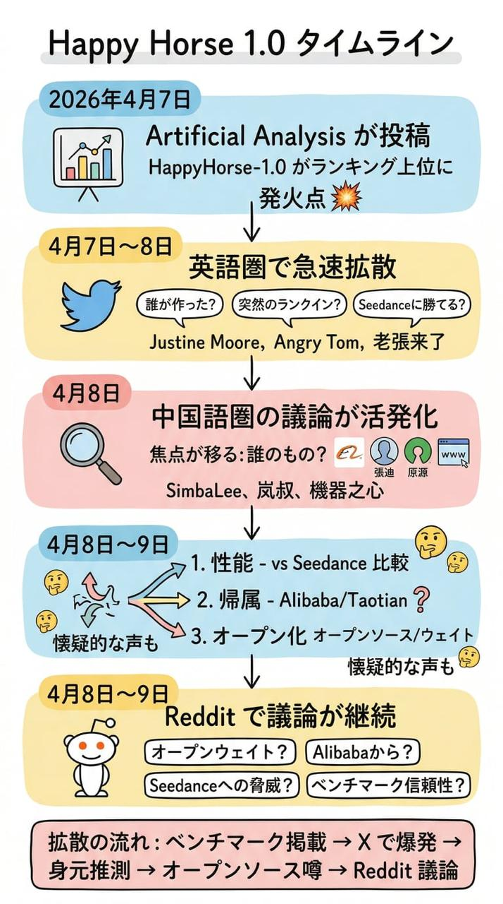

# Happy Horse 1.0

[English](README.md) | [Español](README.es.md) | [Português](README.pt.md) | 日本語 | [한국어](README.ko.md) | [Deutsch](README.de.md) | [Français](README.fr.md) | [Türkçe](README.tr.md) | [繁體中文](README.zh-TW.md) | [简体中文](README.zh-CN.md) | [Русский](README.ru.md)

公式Xアカウント、Alibaba側の公開投稿、コミュニティの反応を含む、Happy Horse 1.0の最新シグナルを一か所で追跡します。

Happy Horse 1.0がトレンドになっているのは、主要なAI動画ベンチマーク議論の上位に食い込み、`@HappyHorseATH`が公式Xアカウントとして現れ、Alibaba Groupもそれについて公開投稿したからです。その一方で、確認済みの公式サイト、公式ドメイン、公式試用URLはまだ存在しません。

[アーリーアクセスに参加](https://evolink.ai/happyhorse-coming-soon?utm_source=github_readme_ja&utm_medium=cta&utm_campaign=happy-horse)

## 目次

- [最新の24時間アップデート](#最新の24時間アップデート)
- [Happy Horse 1.0 ソースマップ](#happy-horse-10-ソースマップ)
- [Happy Horse 1.0がトレンドになっている理由](#happy-horse-10がトレンドになっている理由)
- [Happy Horse 1.0 現在の状況](#happy-horse-10-現在の状況)
- [Happy Horse 1.0 シグナルスナップショット](#happy-horse-10-シグナルスナップショット)
- [X / Twitter上のHappy Horse 1.0](#x--twitter上のhappy-horse-10)
- [Reddit上のHappy Horse 1.0](#reddit上のhappy-horse-10)
- [Happy Horse 1.0 ベンチマーク](#happy-horse-10-ベンチマーク)
- [Happy Horse vs Seedance 2.0](#happy-horse-vs-seedance-20)
- [Happy Horseで作られた製品](#happy-horseで作られた製品)
- [Happy Horse 1.0 FAQ](#happy-horse-10-faq)
- [Happy Horse 1.0 免責事項](#happy-horse-10-免責事項)

## 最新の24時間アップデート

- 過去24時間で789件のX/Twitter投稿を収集し、重複除去後は562件のユニーク投稿でした。
- `@HappyHorseATH` は現在のストーリーの一部であり、Happy Horse の公式Xアカウントとして扱うべきです。
- Alibaba Group も公開の認知 / 祝賀投稿を行いました。
- 確認済みの公式サイト、公式ドメイン、公式試用URLは依然として存在しません。
- Reddit はあくまでコミュニティ議論の場であり、公式性を確定する情報源ではありません。

## Happy Horse 1.0 ソースマップ

現在のHappy Horseナラティブを支える最も有用な公開ソースです。

### ベンチマークパフォーマンス

- [Artificial Analysis on X](https://x.com/ArtificialAnlys/status/2041591989083500933)
- [Justine Moore on X](https://x.com/venturetwins/status/2041554747086553093)
- [Angry Tom on X](https://x.com/AngryTomtweets/status/2041640342764843097)
- [generativeAI on Reddit](https://www.reddit.com/r/generativeAI/comments/1sflqh2/a_new_anonymous_video_model_just_took_1_on/)

### Happy Horse vs Seedance 2.0

- [@laozhang2579 on X](https://x.com/laozhang2579/status/2041461520425746902)
- [Angry Tom comparison post on X](https://x.com/AngryTomtweets/status/2041837603100471308)
- [@joshesye on X](https://x.com/joshesye/status/2041845091795345426)
- [GENEL skeptical take on X](https://x.com/genel_ai/status/2041806001129623577)
- [StableDiffusion thread on Reddit](https://www.reddit.com/r/StableDiffusion/comments/1sfo3dq/a_new_sota_local_video_model_happyhorse_10_will/)

### アリババ / タオティアン帰属

- [SimbaLee on X](https://x.com/lipeng0820/status/2041782008905662592)
- [SimbaLee follow-up on X](https://x.com/lipeng0820/status/2041811824220500028)
- [@LufzzLiz on X](https://x.com/LufzzLiz/status/2041813317124289012)
- [@jiqizhixin on X](https://x.com/jiqizhixin/status/2041814095977181435)
- [StableDiffusion Alibaba thread on Reddit](https://www.reddit.com/r/StableDiffusion/comments/1sfnod2/could_happyhorse_be_zvideo_in_disguise_from/)

### オープンソース / オープンウェイト

- [Jason Zhu on X](https://x.com/GoSailGlobal/status/2041737961159717266)
- [@laozhang2579 open-source claim on X](https://x.com/laozhang2579/status/2041835578921251244)
- [Emily caution on X](https://x.com/IamEmily2050/status/2041997884132934035)
- [LocalLLaMA thread on Reddit](https://www.reddit.com/r/LocalLLaMA/comments/1sfo1dv/happyhorse_maybe_will_be_open_weights_soon_it/)

### 非公式サイト主張 / 試用リンクの噂

- [@laozhang2579 on X](https://x.com/laozhang2579/status/2041461520425746902)
- [@laozhang2579 site link on X](https://x.com/laozhang2579/status/2041835578921251244)
- [Smartpig on X](https://x.com/Smartpigai/status/2041836901188215118)
- [HappyHorse_AI thread on Reddit](https://www.reddit.com/r/HappyHorse_AI/comments/1sgjgoa/all_the_happy_horse_10_prompts_and_video_samples/)

## Happy Horse 1.0がトレンドになっている理由

このトレンドは公式のリリース投稿から始まったのではありません。ベンチマークの可視性が先にあり、次にコミュニティの憶測、帰属の噂、比較動画という順番で広がりました。

最も強力な公開のトリガーはXでのArtificial Analysisのシグナルでした：

- [Artificial Analysis on X](https://x.com/ArtificialAnlys/status/2041591989083500933)
  HappyHorse-1.0がテキスト-to-動画と画像-to-動画のランキングで上位に登場しており、音声部門でも強力なランキングを示していると主張しました。

このベンチマークシグナルは影響力の大きいアカウントによって増幅されました：

- [Justine Moore](https://x.com/venturetwins/status/2041554747086553093)
  マルチショット生成とプロンプト追従に特に強い、1位の新しい動画モデルとして紹介しました。
- [Angry Tom](https://x.com/AngryTomtweets/status/2041640342764843097)
  Googleが静かに何か新しいものをリリースしたのではないかと人々に思わせるほど強力に見える、謎の匿名モデルとして紹介しました。
- [@laozhang2579](https://x.com/laozhang2579/status/2041461520425746902)
  中国語側の反応を捉えました：公式サイトも、論文も、明確な帰属もないのに、突然トップランクに。

## Happy Horse 1.0 現在の状況

公開情報は48時間前よりも明確になっています。最新24時間のサマリーに基づくと：

- Happy Horseは依然として非常に強力なソーシャルモメンタムを持っています。
- Artificial AnalysisはHappyHorse-1.0をAlibabaのATH AIイノベーションユニットのモデルとして公式に特定しました。
- `@HappyHorseATH`は公開ナラティブにおける公式Xアカウントとして可視化されています。
- Alibaba GroupがAlibaba / ATHの関連性を強化する認識投稿を公開しました。
- 確認された公式ウェブサイト、公式ドメイン、公式試用URLはまだありません。現在流通しているサイトや試用リンクは非公式として扱うべきです。
- Artificial Analysisによると、モデルはネイティブオーディオあり・なしのテキスト→動画と画像→動画の4モダリティをサポートし、APIアクセスは2026年4月30日を予定しています。
- オープンソースの主張は依然として流通していますが、最も強力な公開シグナルは確認されたオープンウェイトではなくAPI可用性を示しています。

## Happy Horse 1.0 シグナルスナップショット

過去24時間に収集されたX/Twitterデータセットから：

- 収集された生投稿789件
- 重複排除後のユニーク投稿562件
- クエリバケット：
  - `happyhorse`: 377
  - `-happy-horse-`: 159
  - `-happyhorse`: 23
  - `-快乐小马-`: 3
- 最も目立つテーマ：
  - 帰属の明確化とリーダーボード確認
  - 公式Xアカウントの出現
  - Alibaba / ATH帰属
  - 4月30日のAPIタイミング
  - 偽サイト / 偽公式リンクの明確化
  - Seedance 2.0との並列比較
  - 誤ラベルクリップへの懐疑論

過去24時間のReddit検索結果から：

- ライブ検索フォールバックで5件の関連投稿を取得
- ローカルReddit APIステータス：収集中に403
- 最も活発なコミュニティ：
  - r/HappyHorse
  - r/StableDiffusion
  - 明確化に反応する個別ユーザー投稿

## X / Twitter上のHappy Horse 1.0

X/Twitterは最も強力な初期シグナルが存在する場所です。モメンタム、ナラティブの形成、そして人々がこのモデルについてどう考えているかを理解するのに最適な場所です。

### X/Twitterが言っていること

議論は4つのバケツに分類されます：

1. 帰属の明確化とリーダーボード検証
Artificial AnalysisがHappyHorse-1.0をAlibabaに明示的に結びつけ、Artificial Analysis Video Arenaリーダーボード全体で#1または#2の順位を確認したことに人々が反応しています。

2. Seedance 2.0との比較
これが依然として支配的な比較フレームです。Happy Horseが本物の挑戦者または新しいリーダーだと思うユーザーもいれば、Seedanceの方がより自然または一貫して見えると思うユーザーもいます。

3. 帰属と製品ステータス
帰属の追跡は部分的に解決されました。広く引用された複数の投稿がAlibabaのATH AIイノベーションユニットを指しており、公開ナラティブには公式Happy Horse Xアカウントとアリババグループの認識投稿が含まれるようになりました。

4. アクセスと正当性の混乱
どこで試せるか、どのサイトが公式か、モデルが本当にオープンソースかどうかを知りたがっていますが、最も安全な結論は現在確認された公式ウェブサイトも公式試用URLも存在しないということです。

### 代表的なX/Twitter投稿

- [Artificial Analysis明確化スレッド](https://x.com/ArtificialAnlys/status/2042468511025610775)
  閲覧数32,721、いいね177件。Alibaba帰属、リーダーボードステータス、4モダリティサポート、4月30日APIターゲットに関する最も明確な24時間ソース。

- [Wildminder](https://x.com/wildmindai/status/2042355538567024880)
  閲覧数28,570、いいね246件。720p、24fps、テクスチャ、プロンプト追従、視覚的鮮明さを強調した品質重視の強い反応。

- [HappyHorse公式Xアカウント](https://x.com/HappyHorseATH)
  公式アカウントレベルの更新を追うための主要アカウントです。その存在は、確認された公式ウェブサイトも公式試用URLも依然として存在しないという別の事実を変えません。

- [Wall St Engine](https://x.com/wallstengine/status/2042190307991990430)
  閲覧数27,881、いいね155件。ニッチなAIクリエイターサークルを超えて広がるビジネス・企業アクセスフレーミングの良い例。

- [Alibaba Group認識投稿](https://x.com/AlibabaGroup/status/2042462318370701535)
  Alibaba側からの明示的な公開認識をストーリーに加えるため重要。

- [Brent Lynch](https://x.com/BrentLynch/status/2042252412594135243)
  閲覧数3,462、いいね19件。実際にはSeedance 2.0だった誤ラベルのHappyHorse比較クリップを指摘する有用な懐疑的反論。

### X/Twitterからの主要な示唆

- ベンチマークナラティブは依然としてエンジンですが、純粋な憶測ではなく高い可視性の帰属主張によって強化されています。
- 最も重要な構造的更新は、ストーリーに公式Xアカウントとアリババグループの認識投稿が含まれるようになったことです。
- Happy Horse vs Seedance 2.0のフレーミングは依然として主要な配布ベクターです。
- 最大の24時間信頼更新は、確認された公式ウェブサイトも公式試用URLも依然として存在しないことです。
- 最大の製品更新は報告された4月30日のAPIプランです。
- 懐疑論は「これは本物か？」から「どの比較が本物で正しく帰属されているか？」へとシフトしています。

## Reddit上のHappy Horse 1.0

Redditはこのトピックではずっと小規模ですが、Xバブルを離れてシグナルがどのようにAIコミュニティ全体に解釈されるかを示すために有用です。

### Redditが言っていること

Redditの支配的な質問は：

- これは本物なのか、それともまだ噂に基づいているのか？
- Happy HorseはAlibabaと本当に結びついているのか？
- モデルはいつ、どのような形で来るのか？
- ベンチマークの勝利は実際の比較に反映されているのか？
- 流通している比較コンテンツのどれだけが信頼できるのか？

### 最も関連性の高いRedditスレッド

- [r/HappyHorse: HappyHorse-1.0がArtificial Analysis Video Arenaの全リーダーボードで#1または#2に到達](https://www.reddit.com/search/?q=happy+horse&sort=new&t=day)
  帰属明確化とリーダーボード確認のナラティブをRedditが取り上げている最良のシグナル。

- [r/HappyHorse: Alibabaの「HappyHorse」](https://www.reddit.com/search/?q=happy+horse&sort=new&t=day)
  帰属ナラティブがRedditの議論に引き継がれている明確な例。

- [r/StableDiffusion: Happy Horseの欺瞞的な慣行](https://www.reddit.com/search/?q=happy+horse&sort=new&t=day)
  誤解を招く比較と帰属の質に焦点を当てた新しい懐疑論クラスターの強い例。

- [r/StableDiffusion: 今や公式の正当なHappy Horseアカウントがあるのか、それとも死を拒否する次レベルのエイプリルフールなのか？](https://www.reddit.com/search/?q=happy+horse&sort=new&t=day)
  最新の高可視性帰属投稿の後でも、正当性に関するプラットフォームの不確実性を捉えています。

- [u/Status-Calendar-9494: HappyHorseが来るようだ](https://www.reddit.com/search/?q=happy+horse&sort=new&t=day)
  サブレディットスレッドを超えてロールアウトナラティブを広げるルーズなユーザー投稿コメントを代表しています。

### X にないRedditの追加価値

- 偽または誤ラベルの比較コンテンツに関するより明確な懐疑論
- 新たに可視化されたアカウントやナラティブを信頼すべきかどうかに関するより明確な正当性チェック
- Xのナラティブがシンプルなリテールディスカッションへとより速く変化
- 信頼と帰属が今や純粋なベンチマークハイプと同様に重要であるという有用なシグナル

## Happy Horse 1.0 ベンチマーク

ベンチマークの角度がこのキーワードがホットになっている主な理由です。

読者が理解すべきこと：

- 人々がHappy Horseを議論しているのは、洗練されたローンチがあったからではありません。
- 評判の良い公開の比較文脈で異常に良いパフォーマンスを見せたからです。
- そのベンチマークシグナルが、憶測、リポスト、リバースエンジニアリング、非公式SEOページを引き起こしました。

つまり、ベンチマークの可視性が公式な明確さが存在する前に需要を創り出したということです。

## Happy Horse vs Seedance 2.0

これがデータセット全体で最も重要な比較です。

### 強気の見方

支持者はHappy Horseが：

出典: [@laozhang2579 on X](https://x.com/laozhang2579/status/2041461520425746902)、[Angry Tom comparison post on X](https://x.com/AngryTomtweets/status/2041837603100471308)、[@joshesye on X](https://x.com/joshesye/status/2041845091795345426)

- 新参者として驚くほど強力に見えると主張します
- マルチショットシーケンスで異常に優れている可能性があります
- 詳細なプロンプトを予想よりも良く追従できる可能性があります
- オープン性とアクセスが本物であれば、戦略的に重要になりうります

### 懐疑的な見方

批評家はSeedance 2.0が：

出典: [GENEL skeptical take on X](https://x.com/genel_ai/status/2041806001129623577)、[StableDiffusion thread on Reddit](https://www.reddit.com/r/StableDiffusion/comments/1sfo3dq/a_new_sota_local_video_model_happyhorse_10_will/)

- 一部の比較でまだより自然に見えると主張します
- 物理的な一貫性と動きをより確実に処理します
- 一部の比較文脈で不均等に表面化または露出されている可能性があります

### 戦略的な見方

品質が明確に優れているのではなくただ近いだけだとしても、Happy HorseがこれらでSeedanceに勝つなら依然として重要です：

出典: [SimbaLee on X](https://x.com/lipeng0820/status/2041782008905662592)、[SimbaLee follow-up on X](https://x.com/lipeng0820/status/2041811824220500028)、[@jiqizhixin on X](https://x.com/jiqizhixin/status/2041814095977181435)、[LocalLLaMA thread on Reddit](https://www.reddit.com/r/LocalLLaMA/comments/1sfo1dv/happyhorse_maybe_will_be_open_weights_soon_it/)

- オープン性
- キュー時間
- 展開可能性
- コスト
- ローカルワークフローの採用

現時点では、エコシステムシグナルはまだ初期段階です。Redditではすでにこのキーワードの周りにリポジトリ、プロンプトコレクション、ギャラリーを共有している人々がいますが、このセクションはリンクのダンプにならないよう、キュレーションされた状態を維持すべきです。

## Happy Horse 1.0 FAQ

### これは公式のHappy Horseリポジトリですか？

いいえ。これはソーシャルとコミュニティのシグナルから構築された公開インテリジェンスハブです。

### Happy Horse 1.0はオープンソースですか？

オープンソースの主張は広まっていますが、最新24時間の最も強力な公開シグナルは確認されたオープンウェイトではなく、2026年4月30日の計画されたAPIアクセスを示しています。

### 公式サイトや公式試用リンクはありますか？

現在、公に確認された公式サイト、公式ドメイン、公式試用リンクはありません。そうした主張は現時点では偽または非公式として扱うべきです。

### Happy HorseはSeedance 2.0より本当に優れていますか？

公開の会話は、本物の注目を引き起こすのに十分な競争力があると示しています。すべての真剣なユーザーがすべてのシナリオで明確に優れていることに同意しているとは言っていません。

### なぜ多くの人がアリババについて話しているのですか？

ストーリーが噂から部分的な確認へと移行したからです：Artificial AnalysisがHappy HorseをAlibabaのATH AIイノベーションユニットに結びつけ、`@HappyHorseATH`が公式Xアカウントとして登場し、Alibaba Groupが公開認識メッセージを投稿しました。

### Xがより大きいなら、Redditはなぜ重要なのですか？

RedditがXの生のハイプサイクルよりも懐疑論、オープンウェイトへの関心、ツーリングの意図をより明確に露出するからです。

## Happy Horse 1.0 免責事項

このリポジトリは公式のHappy Horseプロジェクトではありません。研究、モニタリング、発見のためにX/TwitterとRedditからの公開議論を集約しています。公開の主張は素早く変わる可能性があります。信頼できる公式ソースによって直接確認されない限り、噂の技術的詳細、リリース日、帰属の主張は暫定的なものとして扱ってください。
