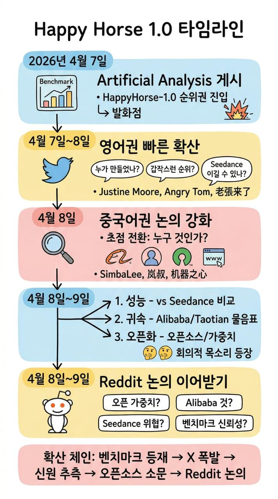

# Happy Horse 1.0

[English](README.md) | [Español](README.es.md) | [Português](README.pt.md) | [日本語](README.ja.md) | 한국어 | [Deutsch](README.de.md) | [Français](README.fr.md) | [Türkçe](README.tr.md) | [繁體中文](README.zh-TW.md) | [简体中文](README.zh-CN.md) | [Русский](README.ru.md)

공식 X 계정, Alibaba 측 공개 게시물, 커뮤니티 반응을 포함한 Happy Horse 1.0의 최신 신호를 한 곳에서 추적하세요.

Happy Horse 1.0이 트렌딩하는 이유는 주요 AI 영상 벤치마크 논의 상위권에 진입했고, `@HappyHorseATH`가 공식 X 계정으로 등장했으며, Alibaba Group도 이에 대해 공개적으로 게시했기 때문입니다. 동시에 확인된 공식 웹사이트, 공식 도메인, 공식 체험 URL은 아직 없습니다.

[얼리 액세스 참여](https://evolink.ai/happyhorse-coming-soon?utm_source=github_readme_ko&utm_medium=cta&utm_campaign=happy-horse)

## 목차

- [최신 24시간 업데이트](#최신-24시간-업데이트)
- [Happy Horse 1.0 소스 맵](#happy-horse-10-소스-맵)
- [Happy Horse 1.0이 트렌딩하는 이유](#happy-horse-10이-트렌딩하는-이유)
- [Happy Horse 1.0 현재 상태](#happy-horse-10-현재-상태)
- [Happy Horse 1.0 신호 스냅샷](#happy-horse-10-신호-스냅샷)
- [X / Twitter의 Happy Horse 1.0](#x--twitter의-happy-horse-10)
- [Reddit의 Happy Horse 1.0](#reddit의-happy-horse-10)
- [Happy Horse 1.0 벤치마크](#happy-horse-10-벤치마크)
- [Happy Horse vs Seedance 2.0](#happy-horse-vs-seedance-20)
- [Happy Horse로 만든 제품](#happy-horse로-만든-제품)
- [Happy Horse 1.0 FAQ](#happy-horse-10-faq)
- [Happy Horse 1.0 면책 조항](#happy-horse-10-면책-조항)

## 최신 24시간 업데이트

- 지난 24시간 동안 X/Twitter 원본 게시물 789개를 수집했고, 중복 제거 후 562개의 고유 게시물이 남았습니다.
- `@HappyHorseATH` 는 이제 최신 스토리의 일부이며 Happy Horse의 공식 X 계정으로 취급해야 합니다.
- Alibaba Group도 공개적인 인정 / 축하 게시물을 올렸습니다.
- 확인된 공식 웹사이트, 공식 도메인, 공식 체험 URL은 여전히 없습니다.
- Reddit는 여전히 커뮤니티 토론 공간일 뿐이며 공식성을 판단하는 근거가 되어서는 안 됩니다.

## Happy Horse 1.0 소스 맵

현재 Happy Horse 내러티브를 형성하는 가장 유용한 공개 출처입니다.

### 벤치마크 성능

- [Artificial Analysis on X](https://x.com/ArtificialAnlys/status/2041591989083500933)
- [Justine Moore on X](https://x.com/venturetwins/status/2041554747086553093)
- [Angry Tom on X](https://x.com/AngryTomtweets/status/2041640342764843097)
- [generativeAI on Reddit](https://www.reddit.com/r/generativeAI/comments/1sflqh2/a_new_anonymous_video_model_just_took_1_on/)

### Happy Horse vs Seedance 2.0

- [@laozhang2579 on X](https://x.com/laozhang2579/status/2041461520425746902)
- [Angry Tom comparison post on X](https://x.com/AngryTomtweets/status/2041837603100471308)
- [@joshesye on X](https://x.com/joshesye/status/2041845091795345426)
- [GENEL skeptical take on X](https://x.com/genel_ai/status/2041806001129623577)
- [StableDiffusion thread on Reddit](https://www.reddit.com/r/StableDiffusion/comments/1sfo3dq/a_new_sota_local_video_model_happyhorse_10_will/)

### 알리바바 / 타오톈 귀속

- [SimbaLee on X](https://x.com/lipeng0820/status/2041782008905662592)
- [SimbaLee follow-up on X](https://x.com/lipeng0820/status/2041811824220500028)
- [@LufzzLiz on X](https://x.com/LufzzLiz/status/2041813317124289012)
- [@jiqizhixin on X](https://x.com/jiqizhixin/status/2041814095977181435)
- [StableDiffusion Alibaba thread on Reddit](https://www.reddit.com/r/StableDiffusion/comments/1sfnod2/could_happyhorse_be_zvideo_in_disguise_from/)

### 오픈소스 / 오픈 웨이트

- [Jason Zhu on X](https://x.com/GoSailGlobal/status/2041737961159717266)
- [@laozhang2579 open-source claim on X](https://x.com/laozhang2579/status/2041835578921251244)
- [Emily caution on X](https://x.com/IamEmily2050/status/2041997884132934035)
- [LocalLLaMA thread on Reddit](https://www.reddit.com/r/LocalLLaMA/comments/1sfo1dv/happyhorse_maybe_will_be_open_weights_soon_it/)

### 비공식 사이트 주장 / 체험 링크 루머

- [@laozhang2579 on X](https://x.com/laozhang2579/status/2041461520425746902)
- [@laozhang2579 site link on X](https://x.com/laozhang2579/status/2041835578921251244)
- [Smartpig on X](https://x.com/Smartpigai/status/2041836901188215118)
- [HappyHorse_AI thread on Reddit](https://www.reddit.com/r/HappyHorse_AI/comments/1sgjgoa/all_the_happy_horse_10_prompts_and_video_samples/)

## Happy Horse 1.0이 트렌딩하는 이유

이 트렌드는 공식 출시 포스트에서 시작되지 않았습니다. 벤치마크 가시성이 먼저였고, 이후 커뮤니티 추측, 귀속 루머, 비교 영상 순서로 퍼져나갔습니다.

가장 강력한 공개 트리거는 X에서 Artificial Analysis가 올린 신호였습니다:

- [Artificial Analysis on X](https://x.com/ArtificialAnlys/status/2041591989083500933)
  HappyHorse-1.0이 텍스트-투-비디오와 이미지-투-비디오 랭킹 최상위에 오르고 있으며, 오디오 부문에서도 강세를 보인다고 주장했습니다.

이 벤치마크 신호는 팔로워가 많은 계정들에 의해 증폭되었습니다:

- [Justine Moore](https://x.com/venturetwins/status/2041554747086553093)
  멀티샷 생성과 프롬프트 팔로잉에서 특히 강세를 보이는 1위 새 영상 모델로 소개했습니다.
- [Angry Tom](https://x.com/AngryTomtweets/status/2041640342764843097)
  구글이 조용히 새것을 출시한 게 아닌지 사람들이 의문을 품을 만큼 강력해 보이는 신비한 익명 모델로 소개했습니다.
- [@laozhang2579](https://x.com/laozhang2579/status/2041461520425746902)
  중국어권 반응을 포착했습니다: 공식 사이트도, 논문도, 명확한 귀속도 없지만 갑자기 최상위권에 등장했다는 내용이었습니다.

## Happy Horse 1.0 현재 상태

공개 정보는 48시간 전보다 더 명확해졌습니다. 최근 24시간 요약을 바탕으로:

- Happy Horse는 여전히 매우 강한 소셜 모멘텀을 가지고 있습니다.
- Artificial Analysis는 HappyHorse-1.0을 Alibaba의 ATH AI 이노베이션 유닛 모델로 공식 확인했습니다.
- `@HappyHorseATH`는 이제 공개 내러티브에서 공식 X 계정으로 가시화되었습니다.
- Alibaba Group이 Alibaba / ATH 연결을 강화하는 공개 인정 게시물을 올렸습니다.
- 확인된 공식 웹사이트, 공식 도메인, 공식 체험 URL은 여전히 없습니다. 현재 유통 중인 사이트나 체험 링크는 비공식으로 취급해야 합니다.
- Artificial Analysis에 따르면 모델은 네이티브 오디오 유무에 따른 텍스트→영상 및 이미지→영상 4가지 모달리티를 지원하며, API 접근은 2026년 4월 30일로 예정되어 있습니다.
- 오픈소스 주장은 여전히 유통되고 있지만, 가장 강력한 공개 신호는 확인된 오픈 웨이트가 아닌 API 가용성을 가리킵니다.

## Happy Horse 1.0 신호 스냅샷

최근 24시간 동안 수집된 X/Twitter 데이터셋에서:

- 수집된 원시 게시물 789개
- 중복 제거 후 고유 게시물 562개
- 쿼리 버킷:
  - `happyhorse`: 377
  - `-happy-horse-`: 159
  - `-happyhorse`: 23
  - `-快乐小马-`: 3
- 가장 눈에 띄는 주제:
  - 귀속 공개 및 리더보드 확인
  - 공식 X 계정 등장
  - Alibaba / ATH 귀속
  - 4월 30일 API 타이밍
  - 가짜 사이트 / 가짜 공식 링크 명확화
  - Seedance 2.0과의 나란히 비교
  - 잘못 라벨된 클립에 대한 회의론

최근 24시간 Reddit 검색 결과에서:

- 라이브 검색 폴백으로 5개의 관련 게시물 수집
- 로컬 Reddit API 상태: 수집 중 403
- 가장 활발한 커뮤니티:
  - r/HappyHorse
  - r/StableDiffusion
  - 공개에 반응하는 개별 사용자 게시물

## X / Twitter의 Happy Horse 1.0

X/Twitter는 가장 강력한 초기 신호가 있는 곳입니다. 모멘텀, 내러티브 형성, 그리고 사람들이 이 모델에 대해 어떻게 생각하는지를 이해하기에 가장 좋은 곳입니다.

### X/Twitter에서 하는 이야기

논의는 네 가지 버킷으로 나뉩니다:

1. 귀속 공개 및 리더보드 검증
Artificial Analysis가 HappyHorse-1.0을 Alibaba와 명시적으로 연결하고 Artificial Analysis Video Arena 리더보드 전반에서 #1 또는 #2 순위를 확인한 것에 사람들이 반응하고 있습니다.

2. Seedance 2.0 비교
이것이 여전히 지배적인 비교 프레임입니다. Happy Horse가 진정한 도전자 또는 새로운 리더라고 생각하는 사용자도 있고, Seedance가 더 자연스럽거나 일관되게 보인다고 생각하는 사용자도 있습니다.

3. 귀속 및 제품 상태
귀속 추적이 부분적으로 해결되었습니다. 널리 인용된 여러 게시물이 Alibaba의 ATH AI 이노베이션 유닛을 가리키며, 공개 내러티브에는 이제 공식 Happy Horse X 계정과 Alibaba Group 인정 게시물이 포함됩니다.

4. 접근 및 정당성 혼란
사람들은 여전히 어디서 사용해볼 수 있는지, 어떤 사이트가 공식인지, 모델이 오픈소스인지 알고 싶어하지만, 가장 안전한 결론은 현재 확인된 공식 웹사이트나 공식 체험 URL이 없다는 것입니다.

### 대표적인 X/Twitter 게시물

- [Artificial Analysis 공개 스레드](https://x.com/ArtificialAnlys/status/2042468511025610775)
  조회수 32,721, 좋아요 177개. Alibaba 귀속, 리더보드 상태, 4가지 모달리티 지원, 4월 30일 API 목표에 대한 가장 명확한 24시간 소스.

- [Wildminder](https://x.com/wildmindai/status/2042355538567024880)
  조회수 28,570, 좋아요 246개. 720p, 24fps, 텍스처, 프롬프트 팔로잉, 시각적 선명도를 강조하는 강력한 품질 중심 반응.

- [HappyHorse 공식 X 계정](https://x.com/HappyHorseATH)
  공식 계정 수준 업데이트를 위해 주목해야 할 핵심 계정입니다. 그 존재는 확인된 공식 웹사이트나 공식 체험 URL이 여전히 없다는 별개의 사실을 바꾸지 않습니다.

- [Wall St Engine](https://x.com/wallstengine/status/2042190307991990430)
  조회수 27,881, 좋아요 155개. 틈새 AI 크리에이터 서클을 넘어 확산되는 비즈니스 및 기업 접근 프레이밍의 좋은 예.

- [Alibaba Group 인정 게시물](https://x.com/AlibabaGroup/status/2042462318370701535)
  Alibaba 측의 명시적인 공개 인정을 스토리에 추가하기 때문에 중요합니다.

- [Brent Lynch](https://x.com/BrentLynch/status/2042252412594135243)
  조회수 3,462, 좋아요 19개. 실제로는 Seedance 2.0이었던 잘못 라벨된 HappyHorse 비교 클립을 지적하는 유용한 회의적 반론.

### X/Twitter의 주요 시사점

- 벤치마크 내러티브는 여전히 엔진이지만, 이제 순수한 추측이 아닌 더 높은 가시성의 귀속 주장으로 강화되었습니다.
- 가장 중요한 구조적 업데이트는 스토리에 공식 X 계정과 Alibaba Group 인정 게시물이 포함되었다는 것입니다.
- Happy Horse vs Seedance 2.0 프레이밍은 여전히 주요 배포 벡터입니다.
- 최대 24시간 신뢰 업데이트는 확인된 공식 웹사이트나 공식 체험 URL이 여전히 없다는 것입니다.
- 최대 제품 업데이트는 보고된 4월 30일 API 계획입니다.
- 회의론은 "이게 진짜인가?"에서 "어떤 비교가 진짜이고 올바르게 귀속되었는가?"로 이동했습니다.

## Reddit의 Happy Horse 1.0

Reddit은 이 주제에서 X보다 훨씬 작지만, X 버블을 벗어난 신호를 더 넓은 AI 커뮤니티가 어떻게 해석하는지 보여주기 때문에 유용합니다.

### Reddit에서 하는 이야기

Reddit의 지배적인 질문들은 다음과 같습니다:

- 이게 진짜인가, 아니면 여전히 루머 기반인가?
- Happy Horse가 실제로 Alibaba와 연결되어 있는가?
- 모델이 실제로 곧 출시될 것인가, 어떤 형태로?
- 벤치마크 승리가 실제 비교에 반영되는가?
- 유통 중인 비교 미디어 중 얼마나 신뢰할 수 있는가?

### 가장 관련성 높은 Reddit 스레드

- [r/HappyHorse: HappyHorse-1.0이 Artificial Analysis Video Arena의 모든 리더보드에서 #1 또는 #2에 올랐습니다](https://www.reddit.com/search/?q=happy+horse&sort=new&t=day)
  귀속 공개 및 리더보드 확인 내러티브를 Reddit이 포착하는 최고의 신호.

- [r/HappyHorse: Alibaba의 "HappyHorse"](https://www.reddit.com/search/?q=happy+horse&sort=new&t=day)
  귀속 내러티브가 Reddit 논의로 이어지는 명확한 예.

- [r/StableDiffusion: Happy Horse의 기만적 관행](https://www.reddit.com/search/?q=happy+horse&sort=new&t=day)
  오해를 불러일으키는 비교와 귀속 품질에 초점을 맞춘 새로운 회의론 클러스터의 강력한 예.

- [r/StableDiffusion: 이제 공식적으로 합법적인 Happy Horse 계정이 생긴 건가요, 아니면 죽기를 거부하는 다음 레벨 만우절 장난인가요?](https://www.reddit.com/search/?q=happy+horse&sort=new&t=day)
  최신 고가시성 귀속 게시물 이후에도 정당성에 대한 플랫폼의 불확실성을 포착합니다.

- [u/Status-Calendar-9494: HappyHorse가 오는 것 같습니다](https://www.reddit.com/search/?q=happy+horse&sort=new&t=day)
  서브레딧 스레드를 넘어 출시 내러티브를 확산시키는 느슨한 사용자 게시물 댓글을 대표합니다.

### X에는 없는 Reddit의 추가 가치

- 가짜 또는 잘못 라벨된 비교 콘텐츠에 대한 더 명확한 회의론
- 새로 가시화된 계정이나 내러티브를 신뢰해야 하는지에 대한 더 명확한 정당성 확인
- X 내러티브가 단순화된 일반 논의로 더 빠르게 변형
- 신뢰와 귀속이 이제 순수한 벤치마크 과대광고만큼 중요하다는 유용한 신호

## Happy Horse 1.0 벤치마크

벤치마크 관점이 이 키워드가 핫해진 주된 이유입니다.

독자들이 이해해야 할 것:

- 사람들이 Happy Horse를 논의하는 것은 세련된 출시 때문이 아닙니다.
- 존경받는 공개 비교 맥락에서 비정상적으로 좋은 성능을 보였기 때문입니다.
- 그 벤치마크 신호가 추측, 리포스트, 역공학, 비공식 SEO 페이지를 촉발했습니다.

즉, 공식적인 명확성이 존재하기 전에 벤치마크 가시성이 수요를 창출했다는 의미입니다.

## Happy Horse vs Seedance 2.0

이것이 전체 데이터셋에서 가장 중요한 비교입니다.

### 낙관적 관점

지지자들은 Happy Horse가:

출처: [@laozhang2579 on X](https://x.com/laozhang2579/status/2041461520425746902), [Angry Tom 비교 게시물 on X](https://x.com/AngryTomtweets/status/2041837603100471308), [@joshesye on X](https://x.com/joshesye/status/2041845091795345426)

- 신규 진입자로서 놀랍도록 강력해 보인다고 주장합니다
- 멀티샷 시퀀스에서 비정상적으로 뛰어날 수 있습니다
- 예상보다 자세한 프롬프트를 더 잘 따를 수 있습니다
- 개방성과 접근이 실제라면 전략적으로 중요할 수 있습니다

### 회의적 관점

비평가들은 Seedance 2.0이:

출처: [GENEL의 비판적 게시물 on X](https://x.com/genel_ai/status/2041806001129623577), [StableDiffusion 스레드 on Reddit](https://www.reddit.com/r/StableDiffusion/comments/1sfo3dq/a_new_sota_local_video_model_happyhorse_10_will/)

- 일부 비교에서 여전히 더 자연스러워 보인다고 주장합니다
- 물리적 일관성과 모션을 더 안정적으로 처리합니다
- 일부 비교 맥락에서 불균형하게 노출될 수 있습니다

### 전략적 관점

품질이 명확히 더 좋은 것이 아니라 단지 비슷하다 해도, Happy Horse가 다음 면에서 이긴다면 여전히 중요할 것입니다:

출처: [SimbaLee on X](https://x.com/lipeng0820/status/2041782008905662592), [SimbaLee follow-up on X](https://x.com/lipeng0820/status/2041811824220500028), [@jiqizhixin on X](https://x.com/jiqizhixin/status/2041814095977181435), [LocalLLaMA 스레드 on Reddit](https://www.reddit.com/r/LocalLLaMA/comments/1sfo1dv/happyhorse_maybe_will_be_open_weights_soon_it/)

- 개방성
- 대기 시간
- 배포 가능성
- 비용
- 로컬 워크플로 채택

현재 생태계 신호는 아직 초기 단계입니다. Reddit에서는 이미 이 키워드 주변에서 레포, 프롬프트 컬렉션, 갤러리를 공유하는 사람들이 있지만, 이 섹션은 링크 덤프가 되지 않도록 큐레이션된 상태를 유지해야 합니다.

## Happy Horse 1.0 FAQ

### 이것이 공식 Happy Horse 저장소인가요?

아닙니다. 이것은 소셜 및 커뮤니티 신호로 구축된 공개 인텔리전스 허브입니다.

### Happy Horse 1.0은 오픈소스인가요?

오픈소스 주장이 광범위하게 퍼져 있지만, 최근 24시간의 가장 강력한 공개 신호는 확인된 오픈 웨이트가 아닌 2026년 4월 30일 계획된 API 접근을 가리킵니다.

### 공식 웹사이트나 공식 체험 링크가 있나요?

현재 공개적으로 확인된 공식 웹사이트, 공식 도메인, 공식 체험 링크는 없습니다. 이런 주장들은 지금 시점에서는 가짜이거나 비공식으로 봐야 합니다.

### Happy Horse가 정말 Seedance 2.0보다 더 좋은가요?

공개 대화에서는 실제 주목을 끌 만큼 경쟁력이 있다고 합니다. 모든 진지한 사용자가 모든 시나리오에서 명확히 더 낫다고 동의한다는 것은 아닙니다.

### 왜 많은 사람들이 알리바바에 대해 이야기하나요?

스토리가 루머에서 부분적 확인으로 이동했기 때문입니다: Artificial Analysis가 Happy Horse를 Alibaba의 ATH AI 이노베이션 유닛과 연결했고, `@HappyHorseATH`가 공식 X 계정으로 등장했으며, Alibaba Group이 공개 인정 메시지를 게시했습니다.

### X가 더 크다면 Reddit이 왜 중요한가요?

Reddit이 원시 X 과대광고 사이클보다 회의론, 오픈 웨이트 관심, 툴링 의도를 더 명확하게 노출하기 때문입니다.

## Happy Horse 1.0 면책 조항

이 저장소는 공식 Happy Horse 프로젝트가 아닙니다. 연구, 모니터링, 발견을 위해 X/Twitter와 Reddit의 공개 논의를 집계합니다. 공개 주장은 빠르게 변할 수 있습니다. 신뢰할 수 있는 공식 출처에 의해 직접 확인되지 않는 한 루머로 된 기술적 세부사항, 출시 날짜, 귀속 주장을 잠정적으로 취급하세요.
