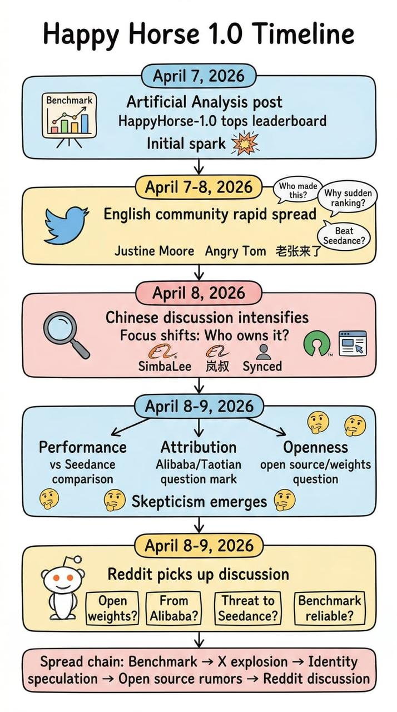

# Happy Horse 1.0

English | [Español](README.es.md) | [Português](README.pt.md) | [日本語](README.ja.md) | [한국어](README.ko.md) | [Deutsch](README.de.md) | [Français](README.fr.md) | [Türkçe](README.tr.md) | [繁體中文](README.zh-TW.md) | [简体中文](README.zh-CN.md) | [Русский](README.ru.md)

Track the latest Happy Horse 1.0 signals in one place, including the official X account, Alibaba-side public posts, benchmark momentum, and community reaction.

Happy Horse 1.0 is trending because it broke into top AI video benchmark discussions, `@HappyHorseATH` appeared as the official X account, and Alibaba Group publicly posted about it. At the same time, there is still no confirmed official website, official domain, or official try-it URL.

[Join Early Access](https://evolink.ai/happyhorse-coming-soon?utm_source=github_readme_en&utm_medium=cta&utm_campaign=happy-horse)

## Table of Contents

- [Latest 24h Update](#latest-24h-update)
- [Happy Horse 1.0 Source Map](#happy-horse-10-source-map)
- [Why Happy Horse 1.0 Is Trending](#why-happy-horse-10-is-trending)
- [Happy Horse 1.0 Current Status](#happy-horse-10-current-status)
- [Happy Horse 1.0 Signal Snapshot](#happy-horse-10-signal-snapshot)
- [Happy Horse 1.0 on X / Twitter](#happy-horse-10-on-x--twitter)
- [Happy Horse 1.0 on Reddit](#happy-horse-10-on-reddit)
- [Happy Horse 1.0 Benchmarks](#happy-horse-10-benchmarks)
- [Happy Horse vs Seedance 2.0](#happy-horse-vs-seedance-20)
- [Products Built With Happy Horse](#products-built-with-happy-horse)
- [Happy Horse 1.0 FAQ](#happy-horse-10-faq)
- [Happy Horse 1.0 Disclaimer](#happy-horse-10-disclaimer)

## Latest 24h Update

- 562 unique X/Twitter posts were captured in the last 24 hours from 789 raw posts.
- `@HappyHorseATH` is now part of the latest story and should be treated as the official X account for Happy Horse.
- Alibaba Group also posted a public recognition message, which strengthens the Alibaba / ATH attribution narrative.
- There is still no confirmed official website, official domain, or official try-it URL. Any currently circulating site or trial link should be treated as unofficial.
- Open-source claims are still circulating, but the strongest current public signal points to API availability rather than confirmed open weights.
- Reddit remains a community discussion surface only. It is useful for tracking skepticism and rumor spread, not for establishing official status.

## Happy Horse 1.0 Source Map

These are the most useful public sources behind the current Happy Horse narrative.

### Benchmark Performance

- [Artificial Analysis on X](https://x.com/ArtificialAnlys/status/2041591989083500933)
- [Justine Moore on X](https://x.com/venturetwins/status/2041554747086553093)
- [Angry Tom on X](https://x.com/AngryTomtweets/status/2041640342764843097)
- [generativeAI on Reddit](https://www.reddit.com/r/generativeAI/comments/1sflqh2/a_new_anonymous_video_model_just_took_1_on/)

### Happy Horse vs Seedance 2.0

- [@laozhang2579 on X](https://x.com/laozhang2579/status/2041461520425746902)
- [Angry Tom comparison post on X](https://x.com/AngryTomtweets/status/2041837603100471308)
- [@joshesye on X](https://x.com/joshesye/status/2041845091795345426)
- [GENEL skeptical take on X](https://x.com/genel_ai/status/2041806001129623577)
- [StableDiffusion thread on Reddit](https://www.reddit.com/r/StableDiffusion/comments/1sfo3dq/a_new_sota_local_video_model_happyhorse_10_will/)

### Alibaba / Taotian Attribution

- [HappyHorseATH on X](https://x.com/HappyHorseATH)
- [Alibaba Group on X](https://x.com/AlibabaGroup/status/2042462318370701535)
- [SimbaLee on X](https://x.com/lipeng0820/status/2041782008905662592)
- [SimbaLee follow-up on X](https://x.com/lipeng0820/status/2041811824220500028)
- [@LufzzLiz on X](https://x.com/LufzzLiz/status/2041813317124289012)
- [@jiqizhixin on X](https://x.com/jiqizhixin/status/2041814095977181435)
- [StableDiffusion Alibaba thread on Reddit](https://www.reddit.com/r/StableDiffusion/comments/1sfnod2/could_happyhorse_be_zvideo_in_disguise_from/)

### Open Source / Open Weights

- [Jason Zhu on X](https://x.com/GoSailGlobal/status/2041737961159717266)
- [@laozhang2579 open-source claim on X](https://x.com/laozhang2579/status/2041835578921251244)
- [Emily caution on X](https://x.com/IamEmily2050/status/2041997884132934035)
- [LocalLLaMA thread on Reddit](https://www.reddit.com/r/LocalLLaMA/comments/1sfo1dv/happyhorse_maybe_will_be_open_weights_soon_it/)

### Unofficial Site Claims / Trial Link Rumors

- [@laozhang2579 on X](https://x.com/laozhang2579/status/2041461520425746902)
- [@laozhang2579 site link on X](https://x.com/laozhang2579/status/2041835578921251244)
- [Smartpig on X](https://x.com/Smartpigai/status/2041836901188215118)
- [HappyHorse_AI thread on Reddit](https://www.reddit.com/r/HappyHorse_AI/comments/1sgjgoa/all_the_happy_horse_10_prompts_and_video_samples/)

## Why Happy Horse 1.0 Is Trending

The trend did not start from an official launch post. It spread because benchmark visibility came first, then community speculation, then attribution rumors, then comparison videos.

The strongest public trigger was the Artificial Analysis signal on X:

- [Artificial Analysis on X](https://x.com/ArtificialAnlys/status/2041591989083500933)
  Claimed HappyHorse-1.0 was landing at the top of text-to-video and image-to-video rankings, including strong placement with audio.

That benchmark signal was amplified by high-reach accounts:

- [Justine Moore](https://x.com/venturetwins/status/2041554747086553093)
  Framed it as a new video model at #1, especially strong in multi-shot generation and prompt following.
- [Angry Tom](https://x.com/AngryTomtweets/status/2041640342764843097)
  Framed it as a mysterious anonymous model that looked strong enough for people to ask whether Google had quietly dropped something new.
- [@laozhang2579](https://x.com/laozhang2579/status/2041461520425746902)
  Captured the Chinese-side reaction: no official site, no paper, no clear attribution, but suddenly top-ranked.

## Happy Horse 1.0 Current Status

Public information is now clearer than it was 48 hours ago. Based on the latest 24-hour summary:

- Happy Horse still has very strong social momentum.
- Artificial Analysis publicly identified HappyHorse-1.0 as an Alibaba model from the ATH AI Innovation Unit.
- `@HappyHorseATH` is now a visible official X account in the public narrative.
- Alibaba Group published a recognition post that reinforces the Alibaba / ATH connection.
- There is still no confirmed official website, official domain, or official try-it URL. Any currently circulating site or trial link should be treated as unofficial.
- Artificial Analysis said the model supports text-to-video and image-to-video, each with and without native audio, and that API access is planned for April 30, 2026.
- Open-source claims are still circulating, but the strongest current public signal points to API availability rather than confirmed open weights.

## Happy Horse 1.0 Signal Snapshot

From the X/Twitter dataset collected over the last 24 hours:

- 789 raw posts collected
- 562 unique posts after deduplication
- query buckets:
  - `happyhorse`: 377
  - `-happy-horse-`: 159
  - `-happyhorse`: 23
  - `-快乐小马-`: 3
- strongest visible themes:
  - attribution reveal and leaderboard confirmation
  - official X account emergence
  - Alibaba / ATH attribution
  - April 30 API timing
  - fake-site / fake-official-link clarification
  - Seedance 2.0 side-by-side comparisons
  - mislabeled-clip skepticism

From the Reddit 24-hour search results:

- 5 relevant posts captured via live search fallback
- local Reddit API status: 403 during collection
- strongest visible communities:
  - r/HappyHorse
  - r/StableDiffusion
  - individual user-post chatter reacting to the reveal

## Happy Horse 1.0 on X / Twitter

X/Twitter is where the strongest early signal lives. It is the best place to understand momentum, narrative formation, and what people think the model means.

### What X/Twitter Is Saying

The discussion clusters into four buckets:

1. Attribution reveal and leaderboard validation  
People are reacting to Artificial Analysis explicitly linking HappyHorse-1.0 to Alibaba and confirming #1 or #2 placement across the Artificial Analysis Video Arena leaderboards.

2. Seedance 2.0 comparison  
This remains the dominant comparison frame. Some users think Happy Horse is a real challenger or new leader, while others still think Seedance looks more natural or consistent.

3. Attribution and product status  
The attribution hunt has partially resolved. Multiple widely cited posts point to Alibaba's ATH AI Innovation Unit, and the public narrative now includes an official Happy Horse X account plus an Alibaba Group recognition post.

4. Access and legitimacy confusion  
People still want to know where to try it, whether a site is official, and whether the model is open source, but the clearest safe takeaway is that there is no confirmed official website or official trial URL right now.

### Representative X/Twitter Posts

- [Artificial Analysis reveal thread](https://x.com/ArtificialAnlys/status/2042468511025610775)  
  32,721 views, 177 likes. The clearest 24-hour source for Alibaba attribution, leaderboard status, four-modality support, and the April 30 API target.

- [Wildminder](https://x.com/wildmindai/status/2042355538567024880)  
  28,570 views, 246 likes. Strong quality-focused reaction emphasizing 720p, 24fps, textures, prompt following, and visual sharpness.

- [HappyHorse official X account](https://x.com/HappyHorseATH)  
  This is now the key account to watch for official account-level updates. Its existence does not change the separate fact that there is still no confirmed official website or official try-it URL.

- [Wall St Engine](https://x.com/wallstengine/status/2042190307991990430)  
  27,881 views, 155 likes. Good example of the business and enterprise-access framing now spreading beyond niche AI creator circles.

- [Alibaba Group recognition post](https://x.com/AlibabaGroup/status/2042462318370701535)  
  Important because it adds explicit Alibaba-side public recognition to the story.

- [Brent Lynch](https://x.com/BrentLynch/status/2042252412594135243)  
  3,462 views, 19 likes. Useful skeptical counterweight calling out a mislabeled HappyHorse comparison clip that was actually Seedance 2.0.

### Main Takeaways From X/Twitter

- The benchmark narrative is still the engine, but now it is reinforced by higher-visibility attribution claims rather than pure speculation.
- The most important structural update is that the story now includes an official X account plus an Alibaba Group recognition post.
- The Happy Horse vs Seedance 2.0 framing is still the main distribution vector.
- The biggest 24-hour trust update is that there is still no confirmed official website or official try-it URL.
- The biggest product update is the reported April 30 API plan.
- Skepticism has shifted from "is this real?" toward "which comparisons are real and properly attributed?"

## Happy Horse 1.0 on Reddit

Reddit is much smaller than X for this topic, but it is useful because it shows how the broader AI community interprets the signal once it leaves the X bubble.

### What Reddit Is Saying

The dominant Reddit questions are:

- Is this real or still rumor-driven?
- Is Happy Horse really tied to Alibaba?
- Is the model actually coming soon, and in what form?
- Are the benchmark wins reflected in real comparisons?
- How much of the circulating comparison media is trustworthy?

### Most Relevant Reddit Threads

- [r/HappyHorse: HappyHorse-1.0 has landed in #1 or #2 across all of the leaderboards in the Artificial Analysis Video Arena](https://www.reddit.com/search/?q=happy+horse&sort=new&t=day)  
  Best signal of Reddit picking up the attribution-reveal and leaderboard-confirmation narrative.

- [r/HappyHorse: Alibaba's very own "HappyHorse"](https://www.reddit.com/search/?q=happy+horse&sort=new&t=day)  
  Clean example of the attribution narrative carrying over into Reddit discussion.

- [r/StableDiffusion: Happy Horse deceiving practices](https://www.reddit.com/search/?q=happy+horse&sort=new&t=day)  
  Strong example of the new skepticism cluster focused on misleading comparisons and attribution quality.

- [r/StableDiffusion: so do we officially have a legit Happy Horse account now or is this some next-level April Fool’s that just refuses to die?](https://www.reddit.com/search/?q=happy+horse&sort=new&t=day)  
  Captures the platform's uncertainty around legitimacy, even after the latest high-visibility attribution posts.

- [u/Status-Calendar-9494: looks like HappyHorse is coming](https://www.reddit.com/search/?q=happy+horse&sort=new&t=day)  
  Represents the looser user-post chatter spreading the rollout narrative beyond subreddit threads.

### What Reddit Adds That X Does Not

- more explicit skepticism about fake or mislabeled comparison content
- a clearer legitimacy check on whether newly visible accounts or narratives should be trusted
- faster mutation of X narratives into simplified retail discussion
- a useful signal that trust and attribution are now as important as raw benchmark hype

## Happy Horse 1.0 Benchmarks

The benchmark angle is the main reason this keyword is hot.

What readers should understand:

- People are not discussing Happy Horse because of a polished launch.
- They are discussing it because it appeared to perform unusually well in a respected public comparison context.
- That benchmark signal then caused speculation, reposting, reverse-engineering, and unofficial SEO pages.

This means benchmark visibility created the demand before official clarity existed.

## Happy Horse vs Seedance 2.0

This is the most important comparison in the entire dataset.

### Bullish View

Supporters argue that Happy Horse:

Sources: [@laozhang2579 on X](https://x.com/laozhang2579/status/2041461520425746902), [Angry Tom comparison post on X](https://x.com/AngryTomtweets/status/2041837603100471308), [@joshesye on X](https://x.com/joshesye/status/2041845091795345426)

- looks surprisingly strong for a new entrant
- may be unusually good at multi-shot sequences
- may follow detailed prompts better than expected
- could matter strategically if openness and access are real

### Skeptical View

Critics argue that Seedance 2.0:

Sources: [GENEL skeptical take on X](https://x.com/genel_ai/status/2041806001129623577), [StableDiffusion thread on Reddit](https://www.reddit.com/r/StableDiffusion/comments/1sfo3dq/a_new_sota_local_video_model_happyhorse_10_will/)

- still looks more natural in some comparisons
- handles physical consistency and motion more reliably
- may be underrepresented or unevenly surfaced in some comparison contexts

### Strategic View

Even if quality is merely close, not clearly better, Happy Horse would still matter if it wins on:

Sources: [SimbaLee on X](https://x.com/lipeng0820/status/2041782008905662592), [SimbaLee follow-up on X](https://x.com/lipeng0820/status/2041811824220500028), [@jiqizhixin on X](https://x.com/jiqizhixin/status/2041814095977181435), [LocalLLaMA thread on Reddit](https://www.reddit.com/r/LocalLLaMA/comments/1sfo1dv/happyhorse_maybe_will_be_open_weights_soon_it/)

- openness
- queue time
- deployability
- cost
- local workflow adoption

## Happy Horse 1.0 FAQ

### Is this an official Happy Horse repository?

No. This is a public intelligence hub built from social and community signals.

### Is Happy Horse 1.0 open source?

Open-source claims are widespread, but the strongest 24-hour public signal points to planned API access on April 30, 2026, not confirmed open weights.

### Is there an official website or official try-it link?

No confirmed one is publicly available right now. Claims about an official website, official domain, or official try-it URL should currently be treated as false or unofficial.

### Is Happy Horse really better than Seedance 2.0?

The public conversation says it is competitive enough to trigger real attention. It does not say that every serious user agrees it is clearly better in every scenario.

### Why are so many people talking about Alibaba?

Because the story moved from rumor to partial confirmation: Artificial Analysis tied Happy Horse to Alibaba's ATH AI Innovation Unit, `@HappyHorseATH` appeared as the official X account, and Alibaba Group posted a public recognition message.

### Why does Reddit matter if X is bigger?

Because Reddit exposes skepticism, open-weights interest, and tooling intent more clearly than the raw X hype cycle.

## Happy Horse 1.0 Disclaimer

This repository is not an official Happy Horse project. It aggregates public discussion from X/Twitter and Reddit for research, monitoring, and discovery. Public claims can change quickly. Treat rumored technical details, release dates, attribution claims, website claims, and try-it links as provisional unless they are directly confirmed through a clearly official public channel.
