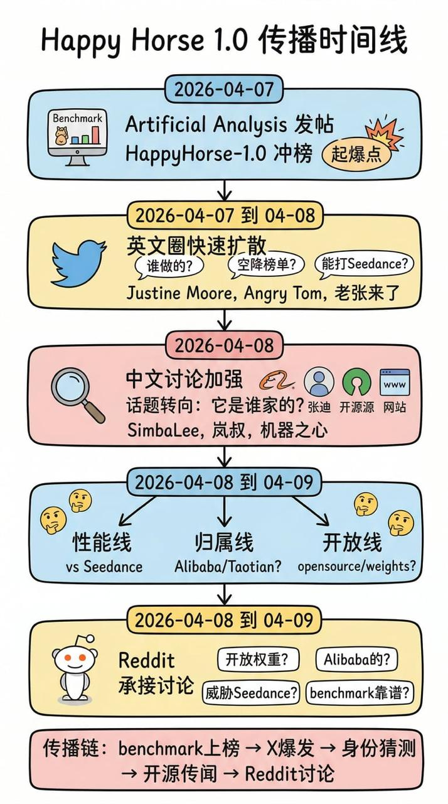

# Happy Horse 1.0

[English](README.md) | [Español](README.es.md) | [Português](README.pt.md) | [日本語](README.ja.md) | [한국어](README.ko.md) | [Deutsch](README.de.md) | [Français](README.fr.md) | [Türkçe](README.tr.md) | [繁體中文](README.zh-TW.md) | 简体中文 | [Русский](README.ru.md)

在同一个地方追踪 Happy Horse 1.0 的最新信号，包括官方 X 账号、阿里巴巴侧公开帖子、榜单热度和社区反馈。

Happy Horse 1.0 之所以成为热门话题，是因为它冲进了主要 AI 视频基准讨论前列，`@HappyHorseATH` 作为官方 X 账号出现，Alibaba Group 也公开发帖提到它。与此同时，目前仍没有被确认的官方网址、官方域名或官方试用入口。

[加入早期访问](https://evolink.ai/happyhorse-coming-soon?utm_source=github_readme_zh_cn&utm_medium=cta&utm_campaign=happy-horse)

## 目录

- [最新 24 小时更新](#最新-24-小时更新)
- [Happy Horse 1.0 信号源图](#happy-horse-10-信号源图)
- [Happy Horse 1.0 为何成为热门](#happy-horse-10-为何成为热门)
- [Happy Horse 1.0 当前状态](#happy-horse-10-当前状态)
- [Happy Horse 1.0 信号快照](#happy-horse-10-信号快照)
- [Happy Horse 1.0 在 X / Twitter 上的动态](#happy-horse-10-在-x--twitter-上的动态)
- [Happy Horse 1.0 在 Reddit 上的动态](#happy-horse-10-在-reddit-上的动态)
- [Happy Horse 1.0 基准测试](#happy-horse-10-基准测试)
- [Happy Horse vs Seedance 2.0](#happy-horse-vs-seedance-20)
- [基于 Happy Horse 构建的产品](#基于-happy-horse-构建的产品)
- [Happy Horse 1.0 常见问题](#happy-horse-10-常见问题)
- [Happy Horse 1.0 免责声明](#happy-horse-10-免责声明)

## 最新 24 小时更新

- 过去 24 小时内共抓取到 789 条原始 X/Twitter 帖子，去重后为 562 条独立帖子。
- `@HappyHorseATH` 已经进入最新叙事，应作为 Happy Horse 的官方 X 账号整理进去。
- Alibaba Group 也发出了公开认领 / 祝贺性质的帖子，进一步强化了阿里巴巴 / ATH 归属叙事。
- 目前仍没有被确认的官方网址、官方域名或官方试用入口。现在流传的任何网站或试用链接，都应视为非官方。
- 开源说法仍在持续传播，但当前最强的公开信号指向的是 API 可用性，而不是已确认的开放权重。
- Reddit 仍然只是社区讨论面，不应用来建立任何官方性判断；它更适合用来观察怀疑情绪和传言扩散。

## Happy Horse 1.0 信号源图

以下是当前 Happy Horse 叙事背后最有价值的公开信息来源。

### 基准性能

- [Artificial Analysis on X](https://x.com/ArtificialAnlys/status/2041591989083500933)
- [Justine Moore on X](https://x.com/venturetwins/status/2041554747086553093)
- [Angry Tom on X](https://x.com/AngryTomtweets/status/2041640342764843097)
- [generativeAI on Reddit](https://www.reddit.com/r/generativeAI/comments/1sflqh2/a_new_anonymous_video_model_just_took_1_on/)

### Happy Horse vs Seedance 2.0

- [@laozhang2579 on X](https://x.com/laozhang2579/status/2041461520425746902)
- [Angry Tom comparison post on X](https://x.com/AngryTomtweets/status/2041837603100471308)
- [@joshesye on X](https://x.com/joshesye/status/2041845091795345426)
- [GENEL skeptical take on X](https://x.com/genel_ai/status/2041806001129623577)
- [StableDiffusion thread on Reddit](https://www.reddit.com/r/StableDiffusion/comments/1sfo3dq/a_new_sota_local_video_model_happyhorse_10_will/)

### 阿里巴巴 / 淘天归属

- [HappyHorseATH on X](https://x.com/HappyHorseATH)
- [Alibaba Group on X](https://x.com/AlibabaGroup/status/2042462318370701535)
- [SimbaLee on X](https://x.com/lipeng0820/status/2041782008905662592)
- [SimbaLee follow-up on X](https://x.com/lipeng0820/status/2041811824220500028)
- [@LufzzLiz on X](https://x.com/LufzzLiz/status/2041813317124289012)
- [@jiqizhixin on X](https://x.com/jiqizhixin/status/2041814095977181435)
- [StableDiffusion Alibaba thread on Reddit](https://www.reddit.com/r/StableDiffusion/comments/1sfnod2/could_happyhorse_be_zvideo_in_disguise_from/)

### 开源 / 开放权重

- [Jason Zhu on X](https://x.com/GoSailGlobal/status/2041737961159717266)
- [@laozhang2579 open-source claim on X](https://x.com/laozhang2579/status/2041835578921251244)
- [Emily caution on X](https://x.com/IamEmily2050/status/2041997884132934035)
- [LocalLLaMA thread on Reddit](https://www.reddit.com/r/LocalLLaMA/comments/1sfo1dv/happyhorse_maybe_will_be_open_weights_soon_it/)

### 非官方站点说法 / 试用入口传言

- [@laozhang2579 on X](https://x.com/laozhang2579/status/2041461520425746902)
- [@laozhang2579 site link on X](https://x.com/laozhang2579/status/2041835578921251244)
- [Smartpig on X](https://x.com/Smartpigai/status/2041836901188215118)
- [HappyHorse_AI thread on Reddit](https://www.reddit.com/r/HappyHorse_AI/comments/1sgjgoa/all_the_happy_horse_10_prompts_and_video_samples/)

## Happy Horse 1.0 为何成为热门

这一热潮并非始于官方发布公告。它的传播路径是：基准曝光在先，社区猜测在后，归属传言随之而来，对比视频随之扩散。

最强的公开触发点来自 Artificial Analysis 在 X 上发布的信号：

- [Artificial Analysis on X](https://x.com/ArtificialAnlys/status/2041591989083500933)
  声称 HappyHorse-1.0 正在跻身文本生成视频和图像生成视频的排名榜首，并在音频方面表现突出。

该基准信号随即被高影响力账号放大传播：

- [Justine Moore](https://x.com/venturetwins/status/2041554747086553093)
  将其定性为排名第一的全新视频模型，尤其在多镜头生成和提示词遵循方面表现强劲。
- [Angry Tom](https://x.com/AngryTomtweets/status/2041640342764843097)
  将其描述为一个神秘的匿名模型，实力之强令人怀疑是否是谷歌悄然推出了某个新产品。
- [@laozhang2579](https://x.com/laozhang2579/status/2041461520425746902)
  捕捉了中文社区的反应：没有官网、没有论文、没有明确归属，却突然登顶排行榜。

## Happy Horse 1.0 当前状态

与 48 小时前相比，公开信息已经更清晰。根据最新 24 小时摘要：

- Happy Horse 仍然保持着很强的社交热度。
- Artificial Analysis 已公开指出 HappyHorse-1.0 是阿里巴巴 ATH AI Innovation Unit 的模型。
- `@HappyHorseATH` 现在已经成为公开叙事中可见的官方 X 账号。
- Alibaba Group 发布了公开认领 / 祝贺帖，进一步强化了阿里巴巴 / ATH 的关联。
- 目前仍然没有被确认的官方网址、官方域名或官方试用入口。现在流传的任何网站或试用链接，都应视为非官方。
- Artificial Analysis 表示该模型支持文生视频和图生视频，且两种模式都支持带原生音频和不带原生音频，同时 API 计划于 2026 年 4 月 30 日开放。
- 开源说法仍在持续传播，但当前最强的公开信号指向的是 API 可用性，而不是已确认的开放权重。

## Happy Horse 1.0 信号快照

来自过去 24 小时收集的 X/Twitter 数据集：

- 共抓取 789 条原始帖子
- 去重后共 562 条独立帖子
- 查询桶分布：
  - `happyhorse`：377
  - `-happy-horse-`：159
  - `-happyhorse`：23
  - `-快乐小马-`：3
- 最明显的讨论主题：
  - 归属披露与榜单确认
  - 官方 X 账号出现
  - 阿里巴巴 / ATH 归属
  - 4 月 30 日 API 时间点
  - 假官网 / 假官方链接澄清
  - 与 Seedance 2.0 的并排对比
  - 对错误标注样例的怀疑

来自过去 24 小时的 Reddit 搜索结果：

- 通过实时搜索回退方式抓到 5 条相关帖子
- 抓取时本地 Reddit API 状态为 403
- 最明显的社区来源：
  - r/HappyHorse
  - r/StableDiffusion
  - 围绕这次认领消息的个人用户帖

## Happy Horse 1.0 在 X / Twitter 上的动态

X/Twitter 是最早且最强烈信号的来源，是了解热度走势、叙事形成以及人们对该模型看法的最佳场所。

### X/Twitter 的讨论方向

讨论主要分为四个维度：

1. 归属披露与榜单验证
人们对 Artificial Analysis 明确将 HappyHorse-1.0 与阿里巴巴联系起来、并确认其在 Artificial Analysis Video Arena 多个榜单中位居 #1 或 #2 作出反应。

2. Seedance 2.0 对比
这依然是最主流的比较框架。一部分用户认为 Happy Horse 已经是真正的挑战者甚至新领先者，另一部分用户仍认为 Seedance 在自然度或一致性上更好。

3. 归属与产品状态
归属追踪已经部分得到解答。多条被广泛引用的帖子都将其指向阿里巴巴的 ATH AI Innovation Unit，而且公开叙事中现在已经出现了官方 Happy Horse X 账号以及 Alibaba Group 的认领 / 祝贺帖。

4. 访问与合法性混淆
用户仍想知道去哪里试用、某个网站是否官方、模型是否开源，但目前最稳妥的结论是：现在没有被确认的官方官网，也没有被确认的官方试用入口。

### X/Twitter 代表性帖子

- [Artificial Analysis 认领帖](https://x.com/ArtificialAnlys/status/2042468511025610775)
  32,721 次浏览，177 个点赞。过去 24 小时里最关键的信息源，集中给出了阿里巴巴归属、榜单位置、四种视频生成模态以及 4 月 30 日 API 计划。

- [Wildminder](https://x.com/wildmindai/status/2042355538567024880)
  28,570 次浏览，246 个点赞。强烈的质量导向反馈，强调了 720p、24fps、纹理、提示词遵循和整体清晰度。

- [HappyHorse 官方 X 账号](https://x.com/HappyHorseATH)
  这是现在最值得持续跟踪的官方账号级来源。但这并不改变另一件事：目前仍没有被确认的官方官网或官方试用入口。

- [Wall St Engine](https://x.com/wallstengine/status/2042190307991990430)
  27,881 次浏览，155 个点赞。很好地体现了这波叙事已经从 AI 创作者圈扩散到商业和企业接入视角。

- [Alibaba Group 认领 / 祝贺帖](https://x.com/AlibabaGroup/status/2042462318370701535)
  重要之处在于它给这条叙事增加了来自阿里巴巴侧的公开认领信号。

- [Brent Lynch](https://x.com/BrentLynch/status/2042252412594135243)
  3,462 次浏览，19 个点赞。很有价值的怀疑视角，指出一条被标注为 HappyHorse 的对比视频其实是 Seedance 2.0。

### X/Twitter 主要结论

- 基准叙事仍然是核心驱动力，但现在它已经被更高传播度的归属说法加固，不再只是纯猜测。
- 最重要的结构性变化是：现在这条叙事里已经出现了官方 X 账号和 Alibaba Group 的公开帖子。
- Happy Horse vs Seedance 2.0 仍然是最主要的传播框架。
- 过去 24 小时里最大的信任更新，是目前仍没有被确认的官方官网或官方试用入口。
- 最大的产品更新，是外界普遍传播的 4 月 30 日 API 计划。
- 怀疑的重点已经从“这东西是真的吗？”转向“哪些对比是真的、标注是否准确？”。

## Happy Horse 1.0 在 Reddit 上的动态

Reddit 在这一话题上的体量远小于 X，但它有助于了解当信号离开 X 生态后，更广泛的 AI 社区如何解读这些信息。

### Reddit 的讨论方向

Reddit 上最主要的问题是：

- 现在这到底是真的，还是仍然是传言驱动？
- Happy Horse 是否真的与阿里巴巴有关？
- 这个模型到底会不会很快上线，以及会以什么形式开放？
- 榜单上的领先是否也体现在真实对比里？
- 现在流传的那些对比内容到底有多少可信度？

### 最相关的 Reddit 帖子

- [r/HappyHorse: HappyHorse-1.0 has landed in #1 or #2 across all of the leaderboards in the Artificial Analysis Video Arena](https://www.reddit.com/search/?q=happy+horse&sort=new&t=day)
  很好地体现了 Reddit 如何接住“归属披露 + 榜单确认”这条主叙事。

- [r/HappyHorse: Alibaba's very own "HappyHorse"](https://www.reddit.com/search/?q=happy+horse&sort=new&t=day)
  是归属叙事向 Reddit 扩散的一个清晰例子。

- [r/StableDiffusion: Happy Horse deceiving practices](https://www.reddit.com/search/?q=happy+horse&sort=new&t=day)
  很典型地代表了新一轮怀疑焦点：误导性对比和错误归因。

- [r/StableDiffusion: so do we officially have a legit Happy Horse account now or is this some next-level April Fool’s that just refuses to die?](https://www.reddit.com/search/?q=happy+horse&sort=new&t=day)
  抓住了平台对合法性的持续不确定感，即使最近已经出现了更高传播度的归属帖子。

- [u/Status-Calendar-9494: looks like HappyHorse is coming](https://www.reddit.com/search/?q=happy+horse&sort=new&t=day)
  代表了更松散的用户侧讨论，说明上线叙事已经开始脱离核心社区向外传播。

### Reddit 相比 X 的独特贡献

- 对假样例和错误标注内容有更明确的怀疑
- 更直接地检验“新出现的账号或叙事到底能不能信”
- 更快地把 X 上的复杂叙事压缩成面向普通用户的简化说法
- 清楚表明现在“信任与归属”几乎和“榜单成绩”一样重要

## Happy Horse 1.0 基准测试

基准角度是这一关键词爆热的主要原因。

读者应理解：

- 人们讨论 Happy Horse 并非因为有一个精心准备的发布。
- 而是因为它在一个受认可的公开比较环境中表现异常出色。
- 该基准信号随后引发了猜测、转发、逆向工程以及非官方 SEO 页面的涌现。

这意味着基准曝光在官方信息出现之前就创造了需求。

## Happy Horse vs Seedance 2.0

这是整个数据集中最重要的比较。

### 看多观点

支持者认为 Happy Horse：

来源：[老张来了 on X](https://x.com/laozhang2579/status/2041461520425746902)，[Angry Tom 对比帖 on X](https://x.com/AngryTomtweets/status/2041837603100471308)，[@joshesye on X](https://x.com/joshesye/status/2041845091795345426)

- 作为新晋入局者表现出乎意料地强劲
- 在多镜头序列方面可能异常出色
- 在遵循详细提示词方面可能优于预期
- 如果开放性和访问权是真实的，可能具有重要的战略意义

### 怀疑观点

批评者认为 Seedance 2.0：

来源：[GENEL 的质疑帖 on X](https://x.com/genel_ai/status/2041806001129623577)，[StableDiffusion 讨论串 on Reddit](https://www.reddit.com/r/StableDiffusion/comments/1sfo3dq/a_new_sota_local_video_model_happyhorse_10_will/)

- 在某些对比中看起来仍更自然
- 在物理一致性和运动处理上更可靠
- 在某些比较场景中可能代表性不足或曝光不均

### 战略观点

即使质量仅仅接近而非明显更好，如果 Happy Horse 在以下方面胜出，它仍然具有重要意义：

来源：[SimbaLee on X](https://x.com/lipeng0820/status/2041782008905662592)，[SimbaLee follow-up on X](https://x.com/lipeng0820/status/2041811824220500028)，[@机器之心 on X](https://x.com/jiqizhixin/status/2041814095977181435)，[LocalLLaMA 讨论串 on Reddit](https://www.reddit.com/r/LocalLLaMA/comments/1sfo1dv/happyhorse_maybe_will_be_open_weights_soon_it/)

- 开放性
- 排队时间
- 可部署性
- 成本
- 本地工作流采用率

## Happy Horse 1.0 常见问题

### 这是官方 Happy Horse 仓库吗？

不是。这是一个基于社交和社区信号构建的公开情报中心。

### Happy Horse 1.0 是开源的吗？

开源声明仍然广泛流传，但过去 24 小时里最强的公开信号指向的是 2026 年 4 月 30 日 API 计划，而不是已确认的开放权重。

### 现在有官方官网或官方试用入口吗？

目前没有公开可确认的官方官网、官方域名或官方试用入口。关于“官方网址”“官方地址”“官方试用地址”的现有说法，都应暂时视为假的或非官方。

### Happy Horse 真的比 Seedance 2.0 更好吗？

公开讨论表明它具有足够的竞争力以引发真实关注，但并未表明每位认真的用户都认为它在所有场景下明显更优。

### 为什么这么多人谈论阿里巴巴？

因为这个故事已经从“传言”推进到了“部分确认”：Artificial Analysis 将 Happy Horse 指向阿里巴巴的 ATH AI Innovation Unit，`@HappyHorseATH` 作为官方 X 账号出现，Alibaba Group 也发出了公开帖子。

### 如果 X 更大，Reddit 为什么重要？

因为 Reddit 比原始的 X 炒作周期更清晰地暴露了怀疑态度、开放权重兴趣和工具使用意图。

## Happy Horse 1.0 免责声明

本仓库并非官方 Happy Horse 项目。它汇聚了来自 X/Twitter 和 Reddit 的公开讨论，用于研究、监控和发现目的。公开声明可能迅速变化。除非通过明确的官方公开渠道被直接确认，否则请将传言中的技术细节、发布日期、归属说法、网址说法和试用链接都视为暂定信息。
